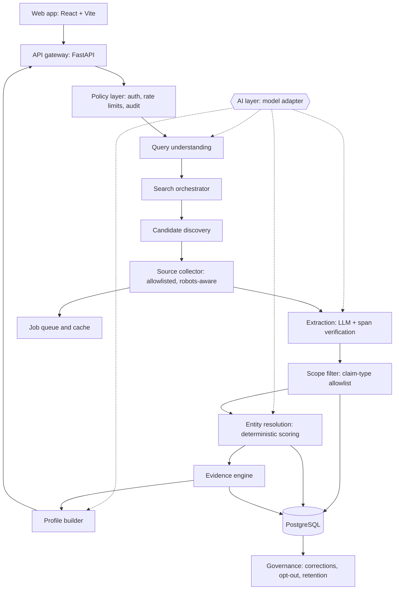
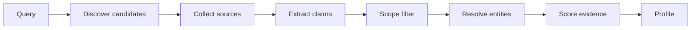

Architecture v1.1 · 1 October 2026 · adds AI integration

# Professional Profile Discovery Platform

A sourced, evidence-first system that assembles professional and public-role information about a named person from fragmented public sources, from V1 through the complete platform.

## 1. Purpose and scope

The platform answers one question: *"What does the public professional record say about this person, and where does each statement come from?"* Every output is a set of claims, each tied to a source, an evidence excerpt, a retrieval date and a confidence level. The system reports "possible match" and "sources indicate", never a definitive identity.

### In scope

- Name, occupation, employer, role
- Publications, talks, patents, projects
- Professional and public-role profiles (company pages, GitHub, conference sites, professional networks)
- Press and official records that name the person in a professional capacity
- Education and credentials the person has published

### Out of scope, permanently

- Home address, phone, personal email
- Family, relationships, daily-life or location tracking
- Biometric identification (face-to-identity)
- Open-ended "who is in this photo" search
- Private, gated or leaked data

The scope is enforced in code, not policy alone: an allowlist of claim types (section 5) is applied at extraction, so out-of-scope data is never stored.

## 2. Design principles

- **Provenance first.** No claim exists without a source, evidence span, retrieval date and confidence.
- **LLM extracts, never decides.** Models pull structured claims from source text; identity decisions are made by deterministic, auditable scoring.
- **Default to unmerged.** A false merge (attributing one person's employer to another) is worse than a missed link. Ambiguity is shown, not hidden.
- **Store less.** Keep extracted claims and URLs, not full page copies, and let records expire and refresh.
- **Accountable use.** Accounts, audit logs, rate limits and a correction/removal path exist from V1.

## 3. System architecture



### Modules

| Module | Responsibility | Notes |
| --- | --- | --- |
| Policy layer | Authentication, per-user rate limits, query audit log, purpose capture | Sits in front of every search |
| Candidate discovery | Turns a name (plus optional hints such as employer or country) into candidate URLs via search providers | Provider-agnostic adapter |
| Source collector | Fetches allowlisted source types, respects robots.txt and terms, records retrieval time | Async workers; per-domain throttling |
| Query understanding | Parses input into name, hints and name variants (AI-assisted) | Schema-constrained output |
| Extraction | LLM returns structured claims with a quoted evidence span | Span must exist verbatim in the source or the claim is dropped |
| Scope filter | Drops any claim whose type is not on the allowlist | Runs before anything is stored |
| Entity resolution | Groups claims into person clusters using weighted signals | Conservative merge threshold; shows alternatives |
| Evidence engine | Aggregates support per claim, flags conflicts and staleness | Confidence from corroboration and source quality |
| Governance | Correction and removal requests, retention expiry, suppression list | Suppressed identities are never re-ingested |

## 4. Technology stack

### Client

React, Vite, Tailwind. Results view with a per-claim evidence drawer.

### Backend

Python FastAPI, async workers (Celery or Arq), Redis for queue and cache.

### Data

PostgreSQL with `pg_trgm` for fuzzy names. OpenSearch only if volume demands it.

### Operations

Containers, CI, structured logging, metrics, secrets manager, object storage for exports only.

## 5. Data model

Claims are separated from people so the same claim can be re-attributed if a cluster is split or corrected.

```
sources        id, url, domain, title, source_type, retrieved_at, expires_at
claims         id, source_id, claim_type, value, evidence_span, extracted_at, confidence
               -- claim_type is an enum: occupation | organization | role |
               --   publication | talk | education | profile_url | project
persons        id, canonical_name, status (active | suppressed), updated_at
person_claims  person_id, claim_id, link_confidence, link_reason
person_names   person_id, name, claim_id
merge_log      id, person_id_a, person_id_b, decision, signals_json, decided_at
queries        id, user_id, input_json, purpose, created_at      -- audit
disputes       id, person_id, claim_id, submitter, status, resolved_at
suppressions   id, match_key, created_at                          -- opt-out list
```

## 6. Pipeline



### Entity resolution signals

Signals are combined into a cluster score; no single weak signal (such as a matching name) can establish identity. Weights are calibrated on a labelled evaluation set, not assumed.

| Signal | Strength |
| --- | --- |
| Name similarity (with variant handling, e.g. John K. Kamau) | Weak |
| Same employer or institution | Medium |
| Same location or sector | Weak to medium |
| Cross-links between sources (a company page linking a GitHub profile) | Strong |
| Shared verified handle, website or ORCID-style identifier | Strong |

## 7. AI integration

AI is used where it adds speed or quality, under one rule: **AI proposes, deterministic code decides.** Every model output is validated before it becomes a claim, a link between records, or text shown to a user.

| Stage | What the model does | Guardrail |
| --- | --- | --- |
| Query understanding | Parses free-text input into name and hints (organization, sector, country); generates spelling and transliteration variants | Output is a fixed schema; hints are optional and shown to the user |
| Extraction | Reads a source and returns structured claims with a quoted evidence span | Span must appear verbatim in the source; claim type must be on the allowlist; failures are dropped |
| Entity resolution | Embedding similarity between profile descriptions; explains borderline pairs in plain language | Contributes one signal to the score; the merge threshold and decision stay deterministic; uncertain stays unmerged |
| Profile summary | Writes a short summary from verified claims only | Each sentence must cite a claim ID; untraceable sentences are removed |
| Conflict and staleness | Flags disagreements between sources and whether they look like a job change or a different person | Flags prompt review or lower confidence; they never overwrite a claim |
| Trust and safety | Helps spot misuse patterns in the audit log; assists labelling of evaluation data | Humans review flags and labels |
| Analyst assistant (V3) | Answers questions over already-verified profiles | Answers only from stored claims and evidence, with citations |

### Never delegated to AI

- Deciding that two records are the same person.
- Filling gaps from the model's own knowledge: if no source says it, the profile does not.
- Inferring sensitive attributes (health, religion, relationships, political views) or anything outside the claim allowlist.
- Identifying people from faces.

### Engineering practices

- **Model adapter.** One interface in front of all providers, so models can be swapped and costs controlled. Use a small, cheap model for bulk extraction and a stronger one for hard cases.
- **Untrusted input.** Web pages can contain text that tries to instruct the model. Extraction prompts are strict, output is schema-constrained, and the extraction step has no tools and cannot take actions.
- **Traceability.** Every prompt and output is logged against the source and claim it produced, so results can be audited and reproduced.
- **Release gating.** Each AI step is tested on a labelled set before release and re-tested when a model or prompt changes.

## 8. API

```
POST /api/v1/search
{ "name": "John Kamau", "hints": { "organization": "ABC Ltd", "country": "KE" } }

200 {
  "results": [{
    "person_id": "p_123", "label": "possible match", "confidence": 0.87,
    "claims": [{
      "type": "occupation", "value": "Software Engineer", "confidence": 0.91,
      "evidence": [{ "source_url": "...", "excerpt": "...", "retrieved_at": "2026-09-30" }]
    }],
    "alternatives": ["p_124", "p_125"]
  }]
}

POST /api/v1/disputes       -- request correction or removal
GET  /api/v1/persons/{id}   -- profile with evidence
```

## 9. Roadmap: V1 to complete

| Phase | Delivers | Exit criteria |
| --- | --- | --- |
| **V1** Name to sourced profile | Name (+ optional hints) search, source collection, extraction with span verification, basic clustering, AI query parsing and extraction with span verification, model adapter and prompt logging, evidence view, accounts, audit log, rate limits, dispute form | Every displayed claim opens to a source; extraction precision measured on a labelled set |
| **V1.5** Quality and safety | Scope filter hardening, staleness detection, retention expiry, suppression list, evaluation harness for common Kenyan and international names, AI test suite gating each model or prompt change, prompt-injection testing | False-merge rate below the agreed target; removal requests honoured within a defined SLA |
| **V2** Depth and coverage | More source adapters (publications, patents, registries, conference and university pages), improved resolution using cross-links and embedding similarity, cited profile summaries, conflict and staleness flags, saved searches, exportable evidence reports | Coverage and accuracy gains verified against the evaluation set |
| **V3** Platform | Organization workspaces with roles, API access and keys, analyst assistant over verified profiles, AI-assisted misuse detection, refresh and change monitoring for professional records, admin and compliance dashboards | Multi-tenant isolation tested; regulator-ready audit exports |
| **Optional** Photo verification | Only to verify that a profile photo already attached to a found candidate matches that candidate's other sources. No open photo-to-identity search, no face recognition. | Separate legal review before build |

## 10. Governance and compliance

- **Legal basis.** The operator is likely a data controller under Kenya's Data Protection Act 2019 (and GDPR for EU users): registration with the ODPC, a documented lawful basis, and data-subject rights need review by counsel before launch.
- **Data subject rights.** Every profile links to a correction and removal process; suppressed identities are excluded from future ingestion.
- **Retention.** Claims expire and are re-verified; no permanent shadow database of individuals.
- **Misuse controls.** Verified accounts, purpose capture, per-user quotas, anomaly alerts on repeated queries about one person, and the right to suspend abusive accounts.
- **Transparency.** Every claim states its source, date and confidence; the interface never presents inference as fact.

## 11. Evaluation

- **Extraction:** precision and recall per claim type on a hand-labelled set; claims failing span verification are counted as rejects.
- **Resolution:** pairwise precision, recall and false-merge rate on ambiguous names; calibrate weights here.
- **Freshness:** percentage of claims re-verified within their window.
- **Trust and safety:** time to resolve disputes, suppression effectiveness, flagged-abuse rate.

## 12. Key risks

| Risk | Mitigation |
| --- | --- |
| Stalking or harassment use | Scope allowlist, accounts, purpose, audit, rate limits, anomaly alerts |
| Wrong person attributed | Conservative merging, visible alternatives, "possible match" language |
| LLM fabricates a claim | Verbatim evidence-span check; LLM never decides identity |
| Prompt injection from web pages | Untrusted-input handling, schema-constrained output, no tools for extraction, injection tests in CI |
| Outdated information | Retrieval dates, expiry, re-verification |
| Source terms or robots violations | Allowlisted source types, per-domain policies, throttling |
| Regulatory exposure | Early legal review, ODPC registration, retention limits |